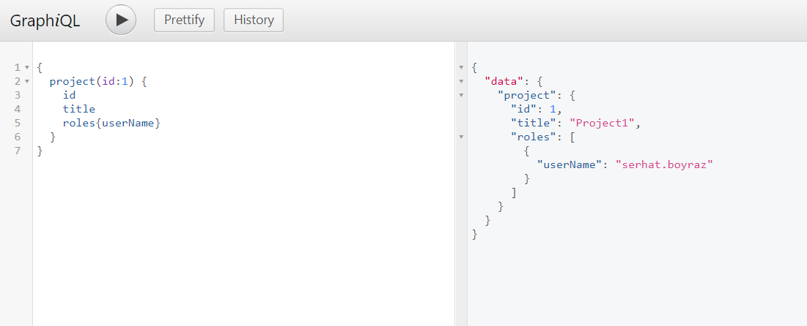

# dotnet-crud-repository
a dotnetcore layered crud repository and unitofworks demo project
now implemented graphql!

# Dependency diagram:

# Startup
Set this environment parameters on your database server setting.

`MYSQL_IP`
`MYSQL_PORT`
`MYSQL_USER`
`MYSQL_PASWORD`
`MYSQL_DB`

And use default all migrations to your database server.

PM> `Update-Database -StartupProject CrudRepositoryExample`

Than database migrations applied, you can use demo api endpoints.

for example send to : 

`PUT http://localhost:8012/User`

And content-type application/json body
`{
	"UserName" : "serhat.boyraz",
	"Password" : "123456"
}`

# graphql 
you can use this project graphiql screen.
Go to  `http://localhost:8012/graphql/` and send this example query : 

`
{
 projects(status : 0){
  title  
  roles {
    userName
  }
}
}
`

you can access the example postman requests this link : 

https://documenter.getpostman.com/view/2234009/S1M3v5FN?version=latest

# enjoy!
